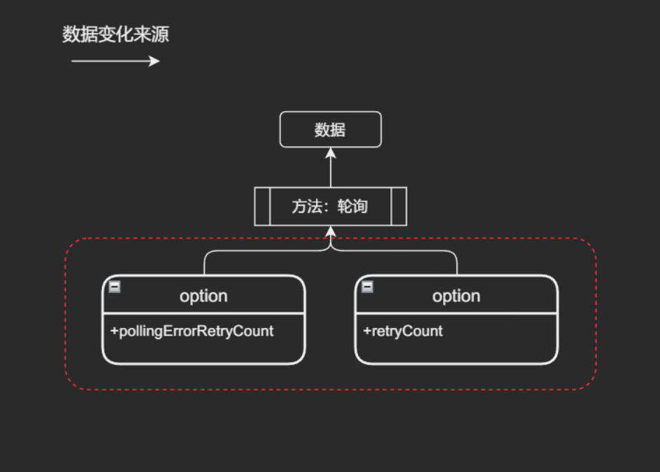
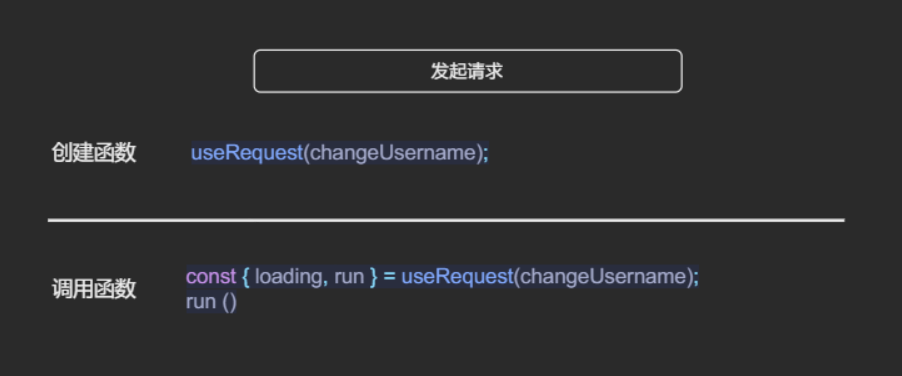
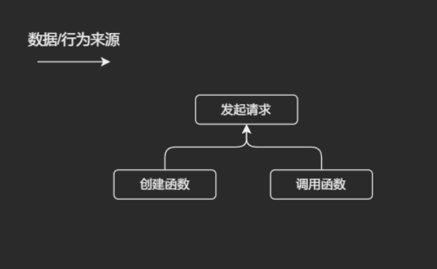
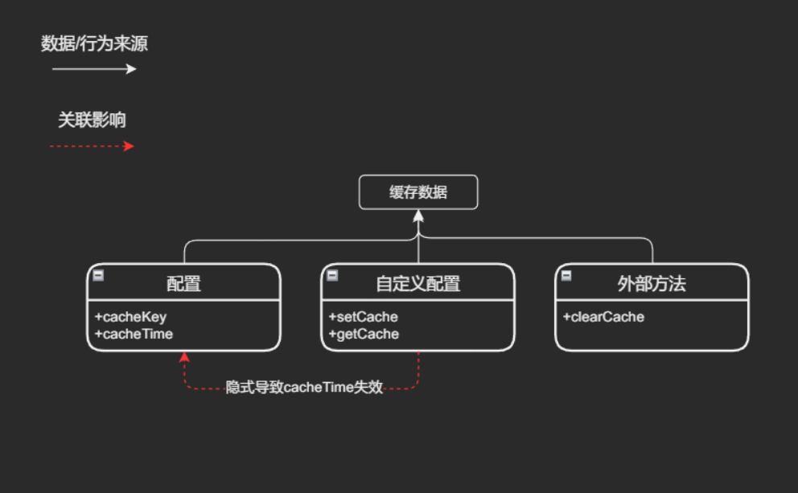
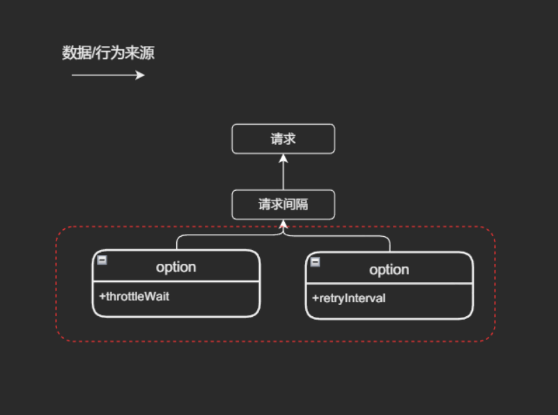
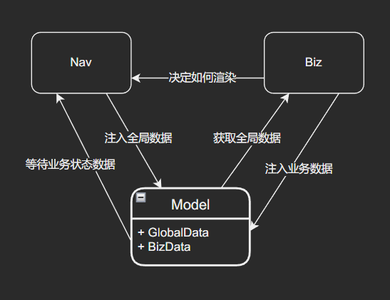
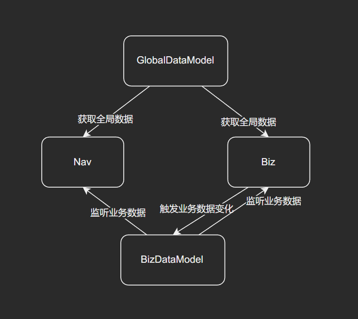
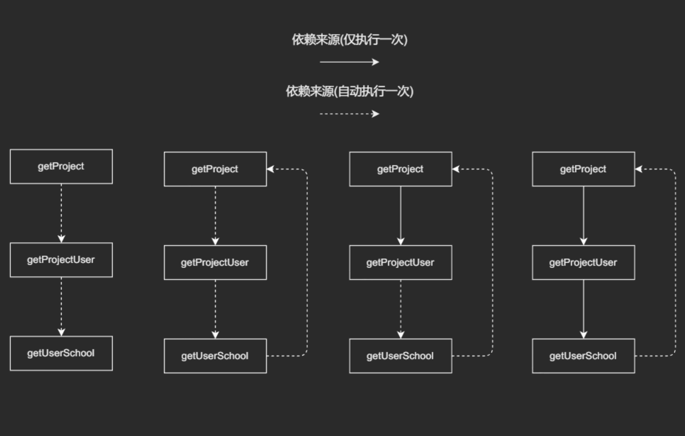
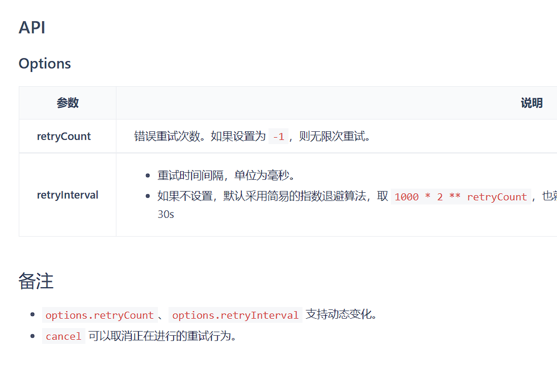

# 比较 useRequest 看组件设计

**请求**是现代前端应用中非常重要的一环，是构建页面基础，但是如何发起请求，如何管理请求，以及如何管理请求中的数据与状态，是当代前端面临的一个非常重要的问题。本示例将通过对比 Ahooks 中的 `useRequest` 和 solidjs 中的 `createResource` 来说明两者在解决这个问题上给出的思路，他们在库/组件设计中所应用的思想以及与之对应的批判，如有异议，欢迎探讨。

## Ahooks 中的设计

官网介绍：一套高质量可靠的 React Hooks 库。包含大量提炼自业务的高级 Hooks。包含丰富的基础 Hooks。

useRequest设计目标：是一个强大的异步数据管理的 Hooks，React 项目中的网络请求场景使用 useRequest 就够了。|

#### Ahooks 中的 useRequest

1. 方法模式： `useRequest/1` 或 `useRequest/2`
2. 参数列表
  
    | 函数参数             | 说明                                                                                                                 |
    | ----------------------------------------- | -------------------------------------------------------------------------------------------------------------------- |
    | 参数位1 `fn` - requestMethod              | 原始请求函数                                                                                                         |
    | 参数位2 `object` - manual                 | 设置为 true 时，useRequest 不会立刻发起请求                                                                          |
    | 参数位2 `object` - onBefore               | 生命周期钩子。请求之前触发                                                                                           |
    | 参数位2 `object` - onSuccess              | 生命周期钩子。请求成功触发                                                                                           |
    | 参数位2 `object` - onError                | 生命周期钩子。请求失败触发                                                                                           |
    | 参数位2 `object` - onFinally              | 生命周期钩子。请求完成触发                                                                                           |
    | 参数位2 `object` - defaultParams          | 首次调用默认参数                                                                                                     |
    | 参数位2 `object` - loadingDelay           | 可以延迟 loading 变成 true 的时间，有效防止闪烁                                                                      |
    | 参数位2 `object` - pollingInterval        | 进入轮询模式，useRequest 会定时触发 requestMethod 执行。可以通过 `cancel` 来停止轮询，通过 `run/runAsync` 来启动轮询 |
    | 参数位2 `object` - pollingErrorRetryCount | 轮询错误重试次数                                                                                                     |
    | 参数位2 `object` - pollingWhenHidden      | 在页面隐藏时，是否继续轮询                                                                                           |
    | 参数位2 `object` - retryCount             | 指定错误重试次数，则 useRequest 在失败后会进行重试                                                                   |
    | 参数位2 `object` - refreshDeps            | 当它的值变化后，会重新触发请求                                                                                       |
    | 参数位2 `object` - refreshOnWindowFocus   | 在浏览器窗口 refocus 和 revisible 时，会重新发起请求                                                                 |
    | 参数位2 `object` - debounceWait           | 进入防抖模式，此时如果频繁触发 run 或者 runAsync，则会以防抖策略进行请求                                             |
    | 参数位2 `object` - throttleWait           | 进入节流模式，此时如果频繁触发 run 或者 runAsync，则会以节流策略进行请求                                             |
    | 参数位2 `object` - cacheKey               | 会将当前请求成功的数据缓存起来                                                                                       |
    | 参数位2 `object` - staleTime              | 缓存数据保持新鲜时间。在该时间间隔内，认为数据是新鲜的，不会重新发请求。如果设置为 -1，则表示数据永远新鲜            |
    | 参数位2 `object` - setCache               | 自定义设置缓存，setCache 和 getCache 需要配套使用                                                                    |
    | 参数位2 `object` - getCache               | 自定义读取缓存                                                                                                       |

    | 返回值  | 说明                                                                                                        |
    | ---------------------------- | ----------------------------------------------------------------------------------------------------------- |
    | data                         | 请求的返回值                                                                                                |
    | error                        | 请求返回的错误                                                                                              |
    | loading                      | 请求状态                                                                                                    |
    | run                          | requestMethod 封装后的方法，同步                                                                            |
    | runAsync                     | requestMethod 封装后的方法，异步                                                                            |
    | refresh                      | 使用上一次的参数，重新发起请求，同步                                                                        |
    | refreshAsync                 | 使用上一次的参数，重新发起请求，异步                                                                        |
    | mutate                       | 立即修改 data                                                                                               |
    | cancel                       | 忽略当前 promise 返回的数据和错误。注意：并不会取消 `promise` 的执行                                        |
    | params                       | 记录当次调用 requestMethod 的参数数组。如果我们设置了 manual = false，则首次参数可通过 defaultParams 来设置 |

    使用示例

    ```typescript
    const {
      loading: boolean,
      data?: TData,
      error?: Error,
      params: TParams || [],
      run: (...params: TParams) => void,
      runAsync: (...params: TParams) => Promise<TData>,
      refresh: () => void,
      refreshAsync: () => Promise<TData>,
      mutate: (data?: TData | ((oldData?: TData) => (TData | undefined))) => void,
      cancel: () => void,
    } = useRequest<TData, TParams>(
      service: (...args: TParams) => Promise<TData>,
      {
        manual?: boolean,
        defaultParams?: TParams,
        onBefore?: (params: TParams) => void,
        onSuccess?: (data: TData, params: TParams) => void,
        onError?: (e: Error, params: TParams) => void,
        onFinally?: (params: TParams, data?: TData, e?: Error) => void,
      }
    );
    ```

## SolidJS 中的设计

官网介绍：Simple and performant reactivity for building user interfaces.

createResource 目标： Creates a signal that reflects the result of an async request.

1. 方法模式： `createResource/1` 或 `createResource/2` 或 `createResource/3`
2. 参数列表

    | 函数参数   | 说明                     |
    | ------------------------------- | ------------------------ |
    | 参数位1 `signal` - sourceSignal | 原始请求的参数信号数据   |
    | 参数位2 `fn` - requestMethod    | 原始请求函数             |
    | 参数位3 `object` - initialValue | SSR 模式中的初始化数据   |
    | 参数位3 `object` - deferStream  | SSR 模式中使用延迟流数据 |

    | 返回值  | 说明                                                |
    | ---------------------------- | --------------------------------------------------- |
    | 元组1 `signal` - signal()    | 请求的返回值                                        |
    | 元组1 `signal` - state       | 请求的当前状态 "unresolved" \| "pending" \| "ready" |
    | 元组1 `signal` - loading     | 请求状态                                            |
    | 元组1 `signal` - error       | 请求返回的错误                                      |
    | 元组1 `signal` - latest      | 请求的最新值                                        |
    | 元组2 `object` - mutate      | 立即修改 signal                                     |
    | 元组2 `object` - refetch     | requestMethod 封装后的方法，异步                    |

    ```typescript
    const [data, { mutate, refetch }] = createResource(sourceSignal, fetchData, {
      initialValue: ...,
      deferStream: ...
    });

    // data() 获取返回数据
    // data.state 获取当前状态
    // data.error 获取错误值
    // ...
    ```
## 请求的难题

在讲两者的问题之前，我们要先来回顾一下，前端请求场景中，开发者有哪些痛点。请求狭义上来讲，是指前端工程师与后端常规服务(Restful API)之间的通信，但更多时候，这个请求模式一旦被抽象之后，可能用于更多的场景中。比如 postMessage、Service Worker 通信等等，因此，实践中，开发者更有可能将当前 `request` 抽象当做所有与外部进程通信的入口。**因此广义来说，前端的请求抽象，几乎管理着所有当前JS环境与外部数据之间的通信**。 但开发者在现实中，可能没有能力或者时间，将这些代码组织在一起，不过从其抽象的程度来说，我们依然可以把它们归为请求的抽象。如果一个公用请求函数处理不了广义上的请求问题，那么它应当处理好狭义上的请求问题，不管是哪类范畴，如果相应的库能够处理好它所这两类目标中的任意一类，我们可以说它至少是解决某类问题的合格库。由于广义问题也包含狭义问题，所以我们将列出广义范围内的所有请求问题：

- **请求方式**
  - XHR & Fetch：即使是常规的异步请求，目前已经有多重方案，不同方案之间存在不同的兼容性差异
  - Beacon 与 Image：在页面离开时也能正确发送请求的技术之间各有不同
  - Polling & WS & SSE & PushEvent：推拉数据模型的各类实现
  - Service Worker & PostMessage: 与外部、本机其他计算资源的通信模式
  - 脚本、JSONP 与其他类型：动态加载资源、跨域、直播流媒体、自定义页面渲染等其他请求模式
- **请求环境**
  - 跨环境请求：移动客户端封装的请求方法、Nodejs 中的请求方法(SSR)、电视等其他客户端中的请求模式不同
- **请求报文与格式**
  - 各类格式兼容：比如 Form-Data 格式，Stream 格式，二进制格式，JSON 格式等等
- **请求状态管理**
  - 场景要求 - 延迟 vs 提前：有时业务要求加载需要在请求发起前，有时需要在请求发起后一段时间
  - 可取消：终止请求
  - 生命周期：请求即将发出，请求中，请求完成，请求错误等状态管理
- **请求时机**
  - 场景要求 - 延迟 vs 提前：请求根据场景需要：立即请求、稍后请求、根据某类开关请求
  - 响应式请求 vs 过程式请求：有时开发者希望依赖数据修改后立即请求，有时需要手动请求
  - 链式请求：某些场景中需要依次处理同类请求，或先后进行不同数据接口的请求（通过 ticket 获取数据）
  - 数据并发：某些场景中需要尽可能地利用并发编排请求
- **数据持久化**
  - 持久化方案：某些场景中需要完成页面级别、页面会话级别、用户会话级别、永久性等持久化方案
  - 过期时间：持久化的过期策略
- **性能**
  - 防抖：避免某类请求重复发送，取消重复的请求
  - 节流：避免某类请求快速发送，以一定速率控制请求频率
- **错误处理**
  - 统一处理 vs 个性化处理：错误时，应当统一处理，还是交由开发特殊处理
  - 隐藏错误 vs 抛出错误：错误应被掩盖，还是向调用上游抛出
  - 重试：错误时是否应该重试，重试策略应是如何
  - JS 中的 catch 行为: Promise 的 .catch 、原生 catch 方法、async 中的错误应如何处理

## 两者的问题

### 两个库的侧重点

- useRequest：想在一个 React hooks 库中尽可能地实现功能，覆盖常见的 Restful API 请求场景。
- createResource: 服务 SolidJS 框架本身的请求管理库，轻量，只能满足较轻的使用场景。

### useRequest

1. 设计目标不符

    Ahooks 中的 useRequest 将自身定义为 `React 项目中的网络请求场景使用 useRequest 就够了`，但是我们了解过它的能力之后会发现，虽然它解决了部分广义范围内的问题，但是他并没有完全做到。它的描述和文档，给了开发者一种错觉——这个方法能用于解决所有请求场景。

    **令人疑惑的场景**
    ```
    // 未实现的功能——相关功能是否支持？
    ws 请求，请求队列...
    // 模棱两可的实现——我应该如何实现？
    Form-Data、二进制...
    ```
    :::warning
    **组件化提示**

    对问题错误、不精准的描述，将得到错误或是误导他人的产物
    :::

2. 冲突的设计
   
    useRequest 中为了实现更多的功能，设计了非常多隐蔽且冲突的模式，这些模式包含了大量歧义，导致使用者无法确定如何使用相关功能。当功能自底向上完成后，缺乏自顶向下的重构，可能是导致相关问题出现的主要原因。

    **令人疑惑的场景**
    ```typescript
    // 考虑如下场景

    /**
     * 1. 轮询中的重试
     * 本例尝试启用轮询功能，但 重试 功能有两种配置，
     * 究竟是哪一种生效，需要开发者自己尝试过之后才知道
     */
    const { data, run, cancel } = useRequest(getUsername, {
      pollingInterval: 3000,
      pollingErrorRetryCount: 5, // 是这个生效？
      retryCount: 3, // 还是这个生效？
    });

    /**
     * 2. 手动请求：
     * 在文档中如此说到：如果设置了 options.manual = true，
     * 则 useRequest 不会默认执行，需要通过 run 来触发执行。
     * 
     * 这里给开发者带来的第一个问题是，useRequest 方法默认会立即调用一次原始请求（非预期）。
     * 该行为大部分情况下是不符合预期的，因为：
     * a. 请求方法本身通常而言需要调用才会执行（预期）—— 开发约定
     * b. 参数并没有显式调用（预期）—— JS 语法
     * c. 作为参数的函数，通常是回调函数（预期）—— JS 最佳实践约定
     * d. 该方法名并没有透露出立即调用的意图（预期）—— 组件设计
     * e. 所有 React 原生操作函数的 hooks 中并没有立即调用某个函数的先例出现（预期）—— 框架心智模型
     * 
     * 第二个问题是 manual 和 run 的关系到底是如何的？
     * 如果不了解 manual 的作用，当开发者看到 manual 时，
     * 可能想到它的作用是“手动上报”，但 run 方法本身就已经是手动控制了，
     * manual 选项控制的又是什么呢
     *
     * 因此从开发者预期的角度而言 `immediate: true` 可能是这个行为和语义更好的实现方式。
     * 通过打开这个开关，触发创建 hooks 时就立即执行才更符合使用者的预期。
     */
    const { loading, run } = useRequest(changeUsername, {
      manual: true
    });
    ```

    

    例子1中，`失败时重试`会改变数据状态和行为，**轮询** 这个行为的触发模式有两种，而且这两者是互相冲突的。

    
  
    

    例子2中，`请求` 行为可能在函数创建时发生，也可能不发生，突破了使用者共识（直觉）；另外完全一致的行为模式有多重触发条件，其中一种是隐式触发，也给使用者增加了困扰。一个功能应当保持一个入口，对于使用者而言，完全一致的功能或行为，不应该有多重实现路径。

    :::warning
    **组件化提示**

    开发阶段，我们的组件总是自底上向地实现，但是实现完之后，应该自顶向下地进行重构。

    应避免不合直觉、约定的实现方式，除非组件的实现将完全重塑使用者的心智模型。
    :::
   
3. 耦合的设计

    useRequest 部分设计出现了耦合的情况，有与浏览器功能耦合，与库的其他方法耦合等。这些耦合增加了使用者的理解成本和使用难度。

    **令人疑惑的场景**
    ```typescript
    // 考虑如下场景

    /**
     * 1. 数据缓存与自定义缓存
     * 文档写道：
     * a. setCache 和 getCache 需要配套使用。在自定义缓存模式下，
     * cacheTime 和 clearCache 不会生效，请根据实际情况自行实现。
     * b. 只有成功的请求数据才会缓存
     * c. 缓存的数据包括 data 和 params
     *
     * a. 由于请求库做了数据缓存的事，该部分的缓存策略有时只需默认实现，有时又需要使用者接管或自定义。
     * 当其需要自行实现时，有部分功能失效，部分功能任然有效，就像一段关系的第三者一样。
     * b. 另外将设置缓存和获取缓存分别设计为两个方法，使用者自定义缓存的隐性条件是两者皆实现才生效，
     * 使得理解成本和使用成本进一步上升
     * c. 清除缓存的方法与 useRequest 方法完全无关，使用者在方法内部找不到自己关注的内容，
     * 相关方法泄露到无关的环境中，开发者无法确认状态/数据的变化可能来自何处
     */
      import { clearCache } from 'ahooks';
      clearCache(cacheKey?: string | string[]);

      const { data, loading } = useRequest(getArticle, {
        cacheKey, // 有效
        cacheTime: 1600, // 失效
        setCache: (data) => localStorage.setItem(cacheKey, JSON.stringify(data)),
        getCache: () => JSON.parse(localStorage.getItem(cacheKey)),
      });

      /**
       * 2. 节流与错误重试
       * 假设某个频繁调用的接口同时实现了节流和错误重试，
       * 正常情况下每隔100ms会被触发一次，由于性能不佳，将其节流为每300ms发送一次
       * 当该接口出错时，我们希望他能按照原来的请求速率以便恢复页面数据，因此需要100ms发送一次
       * 由于两个功能实现在一个方法内，在这样的配置下究竟是按重试的时长发送，
       * 还是按节流的时长进行发送，文档并没有就此说明
       */
      const { data, run } = useRequest(getUsername, {
        throttleWait: 300, // 假如100ms内有10个请求，则会每隔 300ms 发送一次
        retryCount: 10, 
        retryInterval: 100, // 出错时每 100ms 发起一次重试，那么它会生效吗？
      });
    ```

    

    在例子1中，该库试图在保持内部缓存配置生效的前提下提供扩展能力，但出现了几个问题：
    1. 扩展必须成套实现 `getCache/setCache`，让使用者知晓这一要求，并充分实现相关方法在这种配置模式下是困难的，除非库本身完成相关检查并提示错误。
    2. 使用者实现扩展后，原有的部分配置是否生效成为一个难题

    因此，即使提供了扩展，使用者还是需要了解其他配置的实现或冲突细节，不符合 `开闭原则` 的要求。

    另外，`useRequest` 试图解决数据缓存——请求后数据持久化问题，但持久化数据手动清理能力需要额外引入其他方法才能实现，导致缓存状态变化实际上并没有真正受一处控制，清理缓存被解耦为和当前请求数据完全无关的方法，非该数据的所有者也能够使当前数据失效，比如另一个开发者在别处销毁了当前缓存数据，原开发者可能完全不知道在何处销毁的。这一系列操作，没有让 `请求缓存管理` 这一系列方法内聚起来，整体而言，使得功能变得复杂的同时也变得更加难以把控。

    **解决方案**
    ```typescript
    // 方案1: 本库完全剥离 cache 实现
    const { data, loading } = useRequest(getArticle);
    // 方案2: 提供一个自定义 cache 配置，原有 cache 配置完全失效
    const { data, loading } = useRequest(getArticle, {
        cacheKey, // 失效
        cacheTime: 1600, // 失效
        customCache: (data) => {
          // 由用户实现同名配置
          const cacheKey = '...';
          return {
            cacheKey,
            setCache() => localStorage.setItem(cacheKey, JSON.stringify(data))
            getCache() => JSON.parse(localStorage.getItem(cacheKey ?? {})),
            cacheTime() => setTimeout(localStorage.setItem(cacheKey, null))
          }
        }
      });
    // 方案3: 默认缓存的清理方法通过返回值暴露出来
    const { data, loading, clearCache } = useRequest(getArticle,{
      cacheKey,
    });
    ```

    

    例子2中，同一个配置管理了不同的请求间隔，请求间隔于 **请求** 而言是一种复杂的行为状态控制，不同的业务场景会有不同的要求，其中 `错误重试` 和 `节流` 都会影响该行为变化，当两者同时出现在一个配置中时，使用者将无法区分具体何者生效（上图红框部分）。

    实际上，错误重试非常重策略的一类实现，考虑如下 `错误重试` 要求：
    1. 需要在应用全局生命周期都没有请求时，才进行错误重试
    2. 假设该接口RT（响应时间）仅有2ms，应积极重试，在尽可能短的时间内抢占浏览器请求队列
    3. 假设该接口与另一接口形成依赖，该接口的每次请求都需要重新请求上游接口

    此外，节流功能不仅仅应用于 **请求** 场景，在诸如密集计算、渲染等场景中也会用到，简单地把节流集成到请求中，有失妥当。

    :::warning
    **组件化提示**

    组件开发过程中应坚持SOLID原则，复杂的组件和功能应使用设计模式完成。
    :::

### createResource

1. 不可预测的数据

    SolidJS 中获取响应式数据的模式是通过将所有数据转变为可调用的函数实现的，简单说，`data` 必须被 `data()` 调用才能获得真实数据，否则返回一个待执行的函数。这套模式是 SolidJS 的基石，而 `createResource` 中出乎意料的数据获取方式则完全打破了这个模式，提高了使用者的理解成本。

    **令人疑惑的场景**
    ```typescript
    const [data, { mutate, refetch }] = createResource(getQuery, fetchData);
    // 获取返回数据
    data();
    // 获取其他数据
    data.loading;
    data.error;

    /**
     * 为了获取请求的其他数据，既不能通过 data.loading() 的形式也不是通过 data().loading 的形式，
     * 该数据结构的特殊性，打破了框架获取数据的约定，增加了使用成本
     * 更好的做法可能是维持一致性, 将内部数据展开, 如 [data, loading, error, { mutate, refetch }]
     */
    ```
    :::warning
    **组件化提示**

    遵循框架的心智模型和最佳实践，避免反模式出现，除非该组件目标就是完全重塑使用者的心智模型。
    :::

## 组件设计思考

通过上述两个例子的比较，我将提炼出一些较为有用，和初中级前端开发工程师常犯的错误和原则。

### 确定问题的范围

通过上面的例子，我们可以看到 `请求` 这一问题的复杂度并不如工程师日常工作的表面一般，它可浅可深，不同的库选择了不同的侧面来解答这道题。俗话说，好的开始是成功的一半，而**在组件设计方面，确定好问题的范畴，则是这个组件成功的一半**。

通过 `createSource` 的设计我们可以发现，他仅仅处理了较为常见的，或者说基础的前端请求管理问题，而这类问题可能占工程师日常解决请求问题中的80%，另外的 20% 则涉及到更深的，或者不太常见的请求问题领域不在这个库的解决范围内。这样做，保持了库的在实现和使用上的简单性，在开发中保证了可测试性和可维护性。从该库的官方文档可以明确，这个方法所解决的问题与它的设计、实现是保持一致的。相较而言 `useRequest` 在这方面是失败的，它宏大的目标和其实现完全是两码事，甚至为了解决问题引入了更多令使用者也迷惑的设计。

那么，为什么会这样呢？**选择何种问题规模（范围），也决定了我们选择多少种方法论来指导我们的实现**。如果我们是为了**解决某一个具体问题**，我们可以使用 SOLID 原则，指导我们组件的实现，由此，这个库的功能是单一的、好度量的。当我们不再设计单一的功能、方法、工具函数解决某一个问题，而是将视角上升到更复杂的维度，**解决更复杂的一类或一系列问题时**，我们的组件库不能再简单地套用 SOLID 模式，因为它只能帮我们处理组件库的某些部分，过去用于解决单一问题的指导方法必然也就落后了，我们要在此基础上应用解决大规模问题的新思维，诸如组件设计原则，设计模式等内容。

### 符合预期/直觉

不论是在 React 中实现 hooks 组件也好，还是在 Vue 中实现 composition 组件也好，亦或者实现 Web Component 组件也好。**不论采取哪种技术栈，工程师的实现总有其运行环境和背景可言，工程师需要挑选它所期望运行的平台，并为准备好符合预期的实现**。比如现在要实现一个无（框架）依赖的组件库，它需要满足各种框架的调用。在React使用者手里，不应出现 `slot` 之类的字眼，或者 `reactive` 之类的方法，这些模式并不存在于相应的开发者心智模型中，相反，这些模式是符合 Vue 开发者预期的，Vue 工程师们很容易就能上手使用了。除了我们开发时应满足使用者对于框架的预期外，我们也应当满足 JS 开发工程师们的基本预期，比如 `methods(cb)` 中的 `cb` 应是 `methods` 方法执行后的一个回调函数，而不是与 `methods` 调用后立即执行的同步函数。

```typescript
const { loading, run } = useRequest(changeUsername, {
  manual: true
});
```

上述例子中，`useRequest(changeUsername)` 会随 `useRequest` 立即调用就是非预期的场景，不符合预期的使用模式，会给使用者们带来困扰和沮丧。

### 组件依赖之间避免出现环

#### 代码书写中的循环依赖

假设有如下业务场景，我们有三类组件：
1. 我们有一个仅管理所有数据的 Model 组件，包含全局数据 (GlobalData) 和业务数据 (BizData)
2. 一个 Nav 组件，会请求部分 GlobalData 放置到 Model 中，而且它需要 BizData 和 Biz 的状态来确认如何渲染
3. 一个 Biz 组件，它依赖 Model 中的 GlobalData ，同时也会请求 BizData 然后注入到 Model 中

```typescript
const GlobalData = Nav.fetchData();
Model.setGlobal(GlobalData);
const BizData = Biz.fetchData(Model.GlobalData);
Model.setBiz(BizData);
Nav.render(Model.GlobalData, Model.BizData);

// 当依赖数据变化时，需要根据依赖顺序依次调用，若遗漏更新依赖，则会立刻出现错误

const BizData = Biz.fetchData(Model.GlobalData);
// 漏设置 Model 数据
Nav.render(Model.GlobalData, Model.BizData); // 渲染出错
```



在这种不可避免出现环的业务逻辑中，我们可以观察到组件之间的深度依赖。如果我们仅仅使用简单的模式来应对这种场景，那么循环依赖就会立刻带来非常严重的问题，比如我们 Model 组件出错或是修改了某一处数据管理逻辑，它极有可能影响到我们其他所有组件，这种错误传播会带来重大灾难。

```typescript
// 假设 Biz2，Biz3 都依赖 Model 设置数据
const BizData2 = Biz2.fetchData(Model.GlobalData);
const BizData3 = Biz3.fetchData(Model.GlobalData);

// 但是由于 Biz 业务修改了 setBiz 方法，且引入了 Bug，最终导致所有业务方法失败

Model.setBiz(BizData2); // 失败
Model.setBiz(BizData3); // 失败
```

为了解决这种依赖问题，我们通过 **创建新的组件** 来解决这个问题。观察上图我们可以发现，组件管理了数据请求，因此组件间不可避免地需要互相依赖才能完成通信，而其中又引入了只管理状态的组件 Model，因此我们可以考虑从其他分层和关注点来重新抽象我们的组件。假设我们将 Model 中 GlobalData 和 BizData 单独创建为 GlobalDataModel 和 BizDataModel，其内部分别管理了这类数据下的所有内容，包括储存与请求。其后的每类业务数据，我们都将为其创建专门的 `xxxModel` 进行管理。

```typescript
GlobalDataModel.fetchData();
BizDataModel.fetchData();


Nav.listen(BizDataModel) // 监听数据变化，使用了响应式模式
Nav.render(GlobalDataModel.Data);

// 即使老的业务修改，也不影响新的业务
BizDataModel2.fetchData();
BizDataModel3.fetchData();
```



我们再来看一下现在的依赖关系，Nav、Biz 组件都依赖 GlobalDataModel 初始化后请求获得的 GlobalData 数据，Nav 组件则自动监听了 BizDataModel 中的状态变化，目前看起来我们的数据逻辑都比以前更清晰了，而且在代码书写时不再包含循环依赖。

#### 响应式编程陷阱

在上面部分中，我们通过 **新建组件** 方式修改了循环依赖问题，但有一点没有讲到——我们不仅根据新的抽象新建了组件，我们也同样引入了响应式编程模式，而这类模式使用不当时也同样会带来运行时的循环依赖问题。假设我们有这样一类请求，从 `getProject` 获取 `projectId`，然后传递给 `getProjectUser` 获取 `userId`，再接着通过 `getUserSchool` 获取 `school`，目前一切看起来都还好。

```typescript
const { projectId, ... } = useRequest(() => getProject());

const { userId, ... } = useRequest(() => getProjectUser(projectId));

const { school, ... } = useRequest(() => getUserSchool(userId));
```

如果现在 school 获取完成之后，需要调用 `getProject` 重新获取 `projectId` 并渲染页面

```typescript
const { projectId, refreshProject } = useRequest(() => getProject());

const { userId, ... } = useRequest(() => getProjectUser(projectId));

const { school, ... } = useRequest(() => {
  getUserSchool(userId);
  refreshProject();
});
```

在 `useRequest` 中有一个额外的配置 `refreshDeps` 可以根据依赖项自动重新请求数据，假设我们应用这个配置自动获得 `userId`，那么：

```typescript
const { projectId, refreshProject } = useRequest(() => getProject());

const { userId, ... } = useRequest(() => getProjectUser(projectId), {
  refreshDeps: [projectId],
});

const { school, ... } = useRequest(() => {
  getUserSchool(userId);
  refreshProject();
});
```

假设我们让两个有依赖的接口都自动获得根据依赖请求，并且 `getUserSchool` 不再自动触发 `refreshProject`，`projectId` 通过某些用户方法触发刷新，那么：

```typescript
const { projectId, refreshProject } = useRequest(() => getProject());

const { userId, ... } = useRequest(() => getProjectUser(projectId), {
  refreshDeps: [projectId],
});

const { school, ... } = useRequest(() => {
  getUserSchool(userId);
}， {
  refreshDeps: [userId],
});

const onUserClick = () => refreshProject();
```

此时，如果我们检查网络面板，你会发现，用户的一次刷新操作引起好几个无关接口的请求。这个现象在某些场景中特别难以发现，尤其当接口被分散在各种组件中，组件间的数据互相依赖，互相监听，此时用户的操作可能就是一把达摩克利斯之剑。



重新整理依赖图之后，不难发现，我们其实从第二次业务改动开始就创建了循环依赖。随着我们自身将代码修改为响应式之后，虚线部分逐渐变成实线，无关的依赖逐渐被固化下来。在完全形成死循环之前，这种依赖循环导致的问题是较难发现的。

为何仅仅通过修改我们的请求参数，就有如此大的破坏力呢？其原因在 
1. 界面编程和视图更新的繁琐导致社区极致追求响应式编程，大部分工程师在应用响应式编程时，没有意识到响应式数据和模式带来的危险性
2. 难以把控循环依赖，缺乏对自身业务、组件间依赖的认识

其中第一点，我们将在后续小节中讨论，这里着重讨论第二点。在前端工程师的日常中，充斥着大量状态管理，样式编写，兼容性 hack 等问题，较少关注自己的组件、业务中出现的循环依赖，这与设计意识薄弱有关，**工程师们将更多的时间用于解决实际问题，而缺少了抽象与形而上的观察和思考**，当工程师开始意识到这类问题的价值之后才会有所改善。

不论是业务请求中还是组件设计中，循环依赖通常是需要花大功夫才能发现的，需要工程师拿出自己的纸和笔，把自己的设计或流程绘制出来才能发现，而这样避免循环依赖的设计是有意义的，它最大的意义在于，将 Debug 的时间提前，避免线上问题同时提高可维护性。

### 面向发开体验的设计

工程师的组件，根据最终使用者的不同，除了面向可视的、面向终端用户而设计的组件外，还有一类是面向其他技术人员或者同行的组件，或者两者皆具的组件。那么我们在开发过程中应当服务好我们的用户。其中最被组件开发者自身所忽略的就是——**组件的设计，也应当面向开发者自身**。

我们日常的大部分组件，都主要服务于终端用户，较少考虑其他开发人员的使用体验，但**一个优秀的库，往往需要设计地符合同行使用才有更多机会被采用和传播**。这就要求组件作者，应当在组件设计之初，着重考虑其他同行的使用体验。在 [两者的问题](#两者的问题) 中，我们已经着重介绍了那些不好的设计，这些设计即是违反最佳实践和设计模式的，同样也让其他开发人员困惑和反感。设计好一个组件是困难的，组件的开发者必须意识到这一点，设计一个好的组件更是要求深厚的功底。我们再来看几个例子：




上图展示了 `useRequest` 中随处可见的额外 **备注**，这些不在方法内部的例外情况，需要你看到文档最后才会发现，失败的设计无一不在浪费其他使用者的时间。

这些现象提醒我们，在设计方法、抽象的时候，应当注意到我们的使用者并不仅仅只有我们终端用户，如果你看到这些内容时也会紧锁眉头，那你就应该避免自己设计组件时犯下同样的错误。

### 关注点

对问题理解的角度不同、分类不同、功能不同、信念不同等原因，会导致我们的组件设计程序出不同的样貌。比如本文的两个请求库，一个为了解决所有请求问题而生，一个为了解决简单请求问题来，它们两者的出发点不同，因此其内部呈现出天差地别的功能实现。`useRequest` 为了在同一个方法和配置中实现尽可能多的功能，导致配置冲突等情况。

我们现在回过来看 `throttle` 和 `retryInterval` 的问题，我们或许可以将库的关注点分离，通过其他模式来实现同样的功能，并且避免配置间的冲突：
```typescript
const { data, run } = useRequest(getUsername, {
  throttleWait: 300, // 假如100ms内有10个请求，则会每隔 300ms 发送一次
  retryCount: 10, 
  retryInterval: 100, // 出错时每 100ms 发起一次重试，那么它会生效吗？
});
```


```typescript
import retry from '...';
import throttle from '...';
import compose from '...';

// 通过简单的语义将功能开放，提供小颗粒的方法让使用者自行组合实现
const { data, run } = useRequest(getUsername, {
  requestIntervalControl (self) {
    return retry(throttle(self)) // 伪代码，先节流，再进行重试控制
  }
});

// 请求方法本身简单实现，提供组合方方法，让用户自行组合和选择如何使用
const { data, run } = useRequest(getUsername);
const throttleRun = compose(run, throttle); // 组合节流实现
const retryRun = compose(run, retry); // 组合重试实现
const retryRunWithThrottle = compose(throttleRun, retry); // 组合重试与节流，先执行重试逻辑，再节流
```

将关注点拆解后，虽然增加了代码量，但是原有的实现变得简单易懂，功能间的组合更加自由和明确，消除了原有歧义，使业务的开发和测试过程都变得更简单了。

通过上面这个例子我们可以看到，解决相同的问题，作为工程师的我们有非常多可以选择的工具，较为常见的设计模式有 单例模式、观察者模式、MVC 模式、DDD 等等，上面的例子实际上用到了 **函数式编程** 中的 `组合` 设计模式，在不同场景中灵活运用不同的模式，从不同的角度切入问题进行设计，才能让组件变得易于使用，易于维护。

### 消除歧义的设计

```
“能穿多少穿多少”，这句话到底是说要穿的尽可能多，还是尽可能少？

如果加上充足的上下文，就可以消除二义性。比如：“冬天，能穿多少穿多少；夏天能穿多少穿多少”。
```

和上述例子一样，在我们的组件设计和日常工作中，消除二义性（模糊性）是非常重要的工作，编程语言终究也是一门高级语言，它使用英文、数学符号和中文注释等形式完成计算机逻辑编写。开发者们通常无需担心自己的变量名称或者类名过长，因为编译(压缩)后，他们都会以其他形式存在于运行时，反倒是明确、无歧义、具有描述性的命名能帮助使用者或者同行了解代码意图。我们再来看一遍这个例子

```typescript
const { loading, run } = useRequest(changeUsername, {
  manual: true
});
```

这个例子意在描述 `useRequest 在创建时使用手动模式` 还是 `如需关闭 useRequest 创建时的默认请求应设置 manual 属性进行关闭`，相信没有阅读过文档的使用者，完全无法猜出第二种意图。这种和真正实现毫无关联的描述，会给使用者和其他维护人员带来困扰，因为这不仅仅是有歧义的，`手动模式` 光从其意思本身，也让人摸不着头脑。如果要保持其本身的实现不变，我们或许可以修改为：

```typescript
const { loading, run } = useRequest(changeUsername, {
  immediateRequest: false
});
```

虽然增加了文本描述，但是让整个代码意图看起来更加合理了。从这个简单的例子里面，读者就应该能发现，好的命名不仅仅能消除歧义，更能提升组件间的协作和维护性。

### 全家桶与解耦

在我们所举的两个例子中，可以看到，`useRequest` 和 `createResource` 走了两种截然不同的风格，一个是全家桶式将功能塞到一个方法里，另一个则是简单实现了基本功能。对于这两种不同取向，需要依具体场景而定，比如拿设计操作系统和记事本这两者进行比较就是不合适的，解决的问题规模不同，其复杂度也会完全不同。

但是当一个库决定解决何种规模的问题时，应当尽可能地在这个规模的维度把问题解决好，而不是留了一大堆问题给使用者。这里明确批评国内前端的组件和生态，整个社区的风气都在跟风制作臃肿的 UI 组件库，这和国内流行的移动应用一样，有种将各类功能尽收其中的趋势。我们以流行的 Antd 中的一个组件举例：

```
block	将按钮宽度调整为其父宽度的选项	boolean	false	
danger	设置危险按钮	boolean	false	
disabled	设置按钮失效状态	boolean	false	
ghost	幽灵属性，使按钮背景透明	boolean	false	
href	点击跳转的地址，指定此属性 button 的行为和 a 链接一致	string	-	
htmlType	设置 button 原生的 type 值，可选值请参考 HTML 标准	string	button	
icon	设置按钮的图标组件	ReactNode	-	
loading	设置按钮载入状态	boolean | { delay: number }	false	
shape	设置按钮形状	default | circle | round	'default'	
size	设置按钮大小	large | middle | small	middle	
target	相当于 a 链接的 target 属性，href 存在时生效	string	-	
type	设置按钮类型	primary | ghost | dashed | link | text | default	default	
onClick	点击按钮时的回调	(event: MouseEvent) => void	-
```

仅仅一个简单的按钮，就有多达13种配置属性。其 `Form` 组件本身更是从 `3.x` 版本的 8 个属性暴增至 `5.x` 版本中的 22 个！如此膨胀的功能背后，意味着设计的缺失，相比较而言，国外著名 React 表单管理库 `formik` 中的 `useForm` 也仅有 12 个配置项。

随后字节发布的 Arco、腾讯的 TDesign，同样的 `Form` 组件也都达到了近20个左右的配置。在国外新型库已经大步迈进 Headless UI 的时代，国内仍旧报守无意义的轮子和以功能繁复为自豪，这种风潮背后的原因是复杂的吗，这里就不再展开了。

凡是作为一个合格的程序员，都应当意识到，规模复杂的问题，应当通过拆解、复用和扩展的模式来完成，除非有非常强大的功底，否则试图将所有问题塞到一起来实现，充其量不过是个缝合怪。

## 编程范式与风格

在现代应用开发过程中，库作者时常要考虑除了功能之外的内容。这些内容服务我们的使用者，提供更好的架构价值，主要包含两个方面：

1. 库应该是简单直观的，还是需要使用者自己组装和定制的
2. 如何帮助使用者简单、快捷地上手使用
3. 使用者如何扩展他们自己的功能

设计模式虽然能帮助库作者写出不错的库代码，或者一定程度上指导我们在库扩展能力的设计，但是除了设计模式之外，有更加宏观、基础的内容需要库作者掌握。这些内容影响着使用者对于库的理解和初步印象，也影响着使用者的使用方式和思维模式，这些东西比设计模式更为重要。

### 声明式编程与命令式编程

在开始之前我们先看两个例子

```json
{
  "name": "package",
  "version": "1.0.0",
  "description": "",
  "main": "index.js",
  "scripts": {
    "docs:dev": "vitepress dev docs",
    "docs:build": "vitepress build docs",
    "docs:preview": "vitepress preview docs"
  },
  "keywords": [],
  "author": "",
  "license": "ISC",
  "devDependencies": {
    "@algolia/client-search": "^4.14.3",
    "vitepress": "1.0.0-alpha.33",
    "vue": "^3.2.45"
  }
}
```

```typescript
(function(root, factory) {
    console.log('没有模块环境，直接挂载在全局对象上')
    root.umdModule = factory();
}(this, function() {
    return {
        name: '我是一个umd模块'
    }
}))
```

上述两个代码片段，分别是 `npm` 的包管理配置文件和 `UMD` 模块实现方式。不难看出，两者都在处理项目的依赖，但是其使用方式完全不一样。在没有 `npm` 的早期时代，前端工程师更多时候是像第二个例子一样，手动注册模块和管理模块，npm 的诞生大大简化了这个过程，并丰富了 Nodejs 的模块体系。他们对于模块管理的实现范式采用了 `声明式(declarative)编程` 和 `命令式(imperative)编程` 的范式。我们可以发现前者我们所需知道的细节很少，而且更加简单、自动，对于用户更加友好；后者需要关注更多细节，也更加灵活和自由。

其实前端日常使用的很多内容都是声明式的，比如 HTML、CSS、JSON 等等。这些使用方式简单、直观，但是屏蔽了过多细节，也难以表达更多语义。

比如需要根据视口宽度实现元素宽度自适应，同时有所限制，按照声明式的方法只能如此定义:
```css
.example {
  width: 50vw;
}

@media ( min-width: 600px ) {
  .example {
    width: 300px;
  }
}

@media ( max-width: 400px ) {
  .example {
    width: 200px;
  }
}
```
这个方法需要在各个屏幕分辨率之间确定元素宽度，保证每个各个场景下的视觉上下限，同时又保留了部分响应性。但是现在 CSS 有了 `clamp()` 函数，我们就可以做到更简短的自适应间距：

```css
.example {
  width: clamp(200px, 50vw, 300px);
}
```

通过`命令式(imperative)`调用函数，我们得到了一个更为简单和直观的用法。这些例子并不单纯地展示了两类范式的缺陷，我们会发现他们通常糅杂在一起，在合适的时机帮助用户选择自己喜爱的方式构建他们的代码。在这里我们先简单总结一下

1. 声明式(declarative)编程：又叫`配置式(configurable)编程`，在 Vue2 中甚至称之为 Option API，通常定义在外部文件中(如: `package.json, gitlab-ci.yaml`)。封装了大量实现细节，用户能快速、简单上手使用。
2. 命令式(imperative)编程：又叫`程序式(programmatic)编程`，通常与用户代码耦合在一起，需要用户掌握实现细节，具备更多的灵活性。

两者的优点，也同样是对方的缺点，但是这里要指出一个前端开发工程师们在使用 `声明式(declarative)编程` 时常出现的设计陷阱：

1. 冲突的配置：不同名配置的功能重叠或冲突
2. 声明优先级：配置合并时无法确认何者生效
3. 难以表达的语义：复杂语义下表达能力不足

**案例1**

前文中提到的重试间隔就是 **冲突的配置** 表现

```typescript
const { data, run, cancel } = useRequest(getUsername, {
  pollingInterval: 3000,
  pollingErrorRetryCount: 5, // 是这个生效？
  retryCount: 3, // 还是这个生效？
});
```

上述案例中，重试时的错误次数与默认场景下的错误重试机制冲突，假如轮询功能是后续迭代的产物，由于时间紧迫，开发者没有检查已有配置项，试图通过简单地新增一个配置声明解决问题，于是给用户带来了困扰

**案例2**

Vue2 中经常会碰到某些公用组件和业务组件定义相同方法、数据、生命周期时的冲突问题，这类问题常见于 `mixin` 中：

```typescript
const mixins = {
  data() {
    return {
      msg: "Data",
    };
  },
}

// 业务 APP

export default {
  name: "App",
  mixins: [mixins],
  data() {
    return {
      msg: 'data'
    }
  }
};
```

在 Vue2 中，文档详细描述了上述场景的覆盖问题，甚至提供了 `mixinStrategy` 这样的内容让用户自行设置同名配置合并策略，但现在社区广泛认为这样的设计会带来难以预料的问题和隐患

**案例3**

在SQL中使用关系词进行条件查询是很常见的场景：

```sql
SELECT * FROM example_table WHERE x > 1 AND y > 1 OR z = 1;
```

如果需要将上述 `WHERE` 语句部分转换为 JSON，再将该语义恢复为 SQL 则会有些困难：

```json

{
 "OR": [{
  "key": "z",
  "constrain": "=",
  "value": "1"
 }],
 "AND": [{
  "key": "y",
  "constrain": ">",
  "value": "1"
 }, {
  "key": "x",
  "constrain": ">",
  "value": "1"
 }]
}
// 也可以
{
 "OR": [...],
 "AND": [{...}, {...}]
}
```

由于 JSON 没有限制键值的排列顺序，上述例子中，`AND` 可设计为在 `OR` 之后，但是对于用户而言，理解该语义仍是困难的，不论库作者最终生成的 SQL 是否与原来一样

### 响应式编程与函数式编程

`响应式(reactive)编程` 的概念在日常开发中不太常见，这种编程范式在我们日常工作中可谓是无处不在，但我们很少意识到他。考虑如下场景: 

```typescript
let f = a + b;
```

上述代码意为 `a` 与 `b` 通过 `+` 运算赋值给 `f`，这个操作是一次性的。但如果我们定义这串语句本中 `f` 会随 `a`、`b` 的变化自动更新，你可以理解为：

```typescript
let f = Observe(a) + Observe(b);
```

在 `React 16+` 中的形式如下:

```jsx
function Index() {
  const [a, setA] = useState();
  const [b, setB] = useState();

  const f = a + b;

  // 修改 a 与 b ...

  return f 
}
```

在 `Vue 3` 中的形式如下:

```typescript
const a = ref('');
const b = ref('');

// 修改 a 与 b ...

const f = computed(() => a.value + b.value);
```

我们可以很明显的发现，前端目前主流框架所使用的的状态模式几乎都使用了响应式编程，但是这和 `函数式(functional)编程`有何关系呢？我们到目前为止都还没提到它，别急，我们再回顾一下：

```typescript
let f = Observe(a) + Observe(b);

let f = 3 + Observe(b); // 影响 f 变化的只有 b
let f = 3 + 1; // 没有什么东西影响 f 变化
let 5 = 3 + Observe(b); // b 是变化值，但该表达式非法
```

通过变形我们的语句，你可能会发现，整个表达式不再是单纯的赋值语句，你可能会发现这更像数学语言和描述，你或许能回想起这个术语应该叫`等式(equation)` 或 `恒等式(identities)`，

```bash
x+1=3 # 含有未知数的等式
2+1=3 # 不含未知数的等式
```

我们再以 Vue 为例来表达上述等式:

```ts
// 等价 f(x) = 1 + x
const equation = computed(() => 1 + x.value); 

// 等价 3 = 2 + 1
const equation = computed(() => 1 + 2); 
```

**等式(equation)** 的概念：含有等号的式子。如 `x = 1`、`3 = 1 + 2`、`y = x^2`，即使不包含任何 **未知数(unknown number)**，只要包含 `=` 的式子即为等式。

在中文环境中，我们把将含有**待求解未知数**的**等式**叫做**方程(equation)**。比如 `x = 1`，并不称之为 **方程**，而是等式，这在计算机中，我们称之为 `赋值`，形如 `let f = a + b`的表达式，其本质也与 `x = 1`无异，因为他们都不包含 `未知数(unknown number)`，所以都是等式。实际上，数学中的 **方程** 在计算机中，广义而言就是指 `算法`。

至此我们基本理解了命令式编程和函数编程思想在前端日常开发中的渗透，当我们有基本的认识之后，我们也终于进入本小节的重点。

**为什么需要响应式？**

**响应式编程的出发点就是为了简化交互式用户界面的创建和实时系统动画绘制而提出来的一种方法论**。回想一下，如果没有响应式的框架与库，我们将如何操作页面与交互

```typescript
const $el = document.getElementById('target');
$el.innerHtml = `...`;
$el.styles.width = "200px";
$el.styles.height = "80px";
$el.style.padding = "32px"
```

但实际上为了实现上述目标，框架与库对于 `数据状态` 实现，已经脱离了响应式编程的初衷，成为更通用的编程模式。当我们用它解决 `算法` 问题，就会得到：

```ts
const equation = computed(() => 1 + x.value); 
```

当我们如此处理复杂的业务逻辑时，我们也感受到了响应式编程带来的难题。

1. 由于响应式编程的传播性，当我们叠加使用响应式状态和数据，数据之间的关系也随之更难把握，数据变化也愈发难以追踪和理解，甚至是 `非响应式(passive)编程` 代码也会受到影响。

案例1: 错误传播
```jsx
// global.ts 文件
function useGlobalState() {
  // computedState 依赖内部的
  const computedState = globalStateX + globalStateY;
  return { computedState, setGlobal };
}

// a.ts文件
function A () {
  const [_. setGlobal] = useGlobalState();

  ...

  // A 中修改了 globalStateX 状态
  setGlobal(x)
}

// b.ts文件
function B () {
  const [_. setGlobal] = useGlobalState();
  
  // B 中修改了 globalStateY 状态
  setGlobal(y)
}

// main.ts文件
function Main () {
  // 使用者无法得知 computedState 的变化来自于何处
  const { computedState } = useGlobalState();
}
```

上述案例中，`Main` 中的 `computedState` 数据变化时，开发者无从得知是何处产生的，当错误发生时，`Main` 开发者需要了解 `useGlobalState` 的实现，由于错误还可能从任意 (A 或 B) 组件的调用方传递到 `Main`，开发者还需继续深入代码。可想而知，依赖复杂的场景下，上述错误需要耗费很大的精力排查。我们在 [useRequest 循环依赖例子](#代码书写中的循环依赖)中也见到了类似的场景的威力。

难道非响应式实现下，这种情况会变得更好吗:

```ts
// main.ts文件
function Main () {
  const { globalStateX, globalStateY } = useGlobalState();
  // 由于 global 失去了响应性，Main 维护者需要自己组装数据
  const computedState = globalStateX + globalStateY;
}
```

上述代码中，我们简单地去除了部分响应性， `Main` 作者维护了更多实现细节，获得了一定程度上的控制能力，但是可想而知，代码也变得更加臃肿了。假设我们将 React 的响应式能力完全去除，代码虽然不再包含错误传播，但是每个实现所需关注的细节也变得更多了，最后可能会回到 `jQuery` 时代。

案例2：与非响应性代码互操作

```ts
// React 组件
function useReactiveData () {
  const [state. setState] = useState();
  return {
    state,
    setState
  }
  
}

// 单纯 JS 文件
const reactiveData = useReactiveData();

// reactiveData 执行将会失败，useReactiveData 无法脱离 React 执行


// React 组件

const nativeReactiveObject = Object.defineProperty({}, 'val', {
  set() {...}
  get() {...}
})

function useReactiveData () {

  // 在库中使用 getter、setter、proxy 等被视为反模式
  
}
```

在和视图库互操作的过程中，开发者会发现，很多响应性特性脱离了库就无法保持；而库中使用 JS 原生响应式对象，又被认为是 `反模式(anti-pattern)` 的；不同库之间的状态通信更是难于登天，所谓的**微前端**将各自库状态隔离，通过更大的`桥`进行通信，最为荒诞的是所有库的生态都在 JS 之下。各个库的生态无法兼容已有 JS 生态，需要在各自封闭的生态上扩展，相关库衍生出各自相应的实现。正在流行的 `Headless UI` 为了兼容各个库，干脆将数据层完全抽象，提供相应库的数据层包装 `@headlessui/react`、`@headlessui/vue` 才能实现复用。

**为什么需要函数式？**

了解了前端的响应式编程实践之后，当我们从 `响应式编程` 中推导出数学等式时，我们就不难理解，`函数式编程` 其实是为了实践 `响应式编程` 带来的副产物。

实际上函数式编程的内容远不止严格定义变量和控制副作用两种，在 《整洁架构》一书中，作者将函数式编程的架构意义定义为 `限制和规范了程序中的赋值`，在真正的函数式语言中，不存在任何变量，我们也无法自由执行 `f = a + b` 这样的表达式。

```rust
// 定义 A 对象
let x = A {
    item: String::from("item"),
};

// y 获取 x
let y = x;

// 出错：x 值已被移动
let z = x;
```

函数式在前端的意义主要体现于限制了原型链的使用，控制了对象传递和引用，让开发者理解复用可以通过组合实现，加深了开发者对数据所有权的意识。它的主要缺点在于理解难度和可读性，好在大部分前端开发者并不真正理解函数式编程，也并不真正需要函数式编程，其实在大部分现代编程语言中，都或多或少借鉴了函数式编程思想，并采纳了部分易于使用的能力而放弃了晦涩难懂的部分，我们通过一个例子来了解：

```typescript
function add (a, b, c) {
	return a + b + c;
}

// 使用 add 函数
add(1, 2 ,3)

// 对 add 函数进行柯里化
const curryAdd = curry(add);

// 使用 curryAdd 函数
curryAdd(1)(2)(3)
```

上述例子演示了柯里化的能力——将单次调用函数，转换为多次传参才能调用的函数，这是前端社区过去非常推崇的一种炫技方式，如果你能实现出 `curry` 函数本身，那你就是最靓的仔。但是，在我们实际业务中，或者笔者本人的职业生涯中，到目前为止，从来没有遇到过一次需要该方法的场景。而这个方法在其他纯函数语言中是非常重要的，比如 `Haskell`，它的函数参数不能超过2个，所以这个辅助函数是必须的。如果我们在 JS 中生搬硬套，反而让代码更难阅读，或者让库变得更难使用。在即将淘汰的 `webpack` 库中，由于使用了 `compose`(组合代码，类似 `pipe`) 方法用于加载 `loader`，该方法的特殊实现导致 `webpack` 中的 `loader` 加载顺序并不是 `书写时` 的从上到下执行，而是从下到上执行，一度让这个知识点成为评价前端开发能力`“高低”`的重要标准，而掌握这样的知识在大部分业务和库中都是毫无意义的。

总结一下，本小节主要介绍了响应式编程和函数式编程在前端中的由来，以及两者的一些缺陷和陷阱，整个章节并没有深入和全面地讲解两者的优缺点和适合使用的场景，因为本文的重点在于提高初级库开发者对于前端目前所使用的范式的理解，避免在设计和实现库时，陷入这些范式常见的错误之中，如果读者有兴趣可以自行查找相关内容做进一步深入。

### 函数重载与命名方法

由于 JS 本身并不限制如何定义函数和使用函数，TS 作为 JS 的超集，自然而然实现了函数重载的定义：

```ts
declare function N (paramA: string, paramB: string): void;
declare function N (paramA: number, paramB: number): void;
declare function N (paramA: number, paramB: string): void;
```

上述函数 `N` 的定义都是合法的，使用哪一个函数签名，由 TS 负责推导。

```ts
function N (paramA: string | number, paramB: string | number) {
  if (typeof paramA === 'string') ...
  if (typeof paramB === 'string') ...
  if (typeof paramA === 'number' and typeof paramB === 'string') ...
}
```

不难想象，上述内容就是我们的真正实现，TS 只是满足了我们对于类型的需求。但是当代的新语言如 `go` 和 `rust` 都抛弃了函数重载的用法。`go` 在其官网FAQ 中写道 `“函数重载有时是有用的，但实践中更有可能的是让人困惑，带来代码的脆弱性”`，通过上面的例子不难发现，为了实现功能拓展，我们在代码中使用了大量 `if` 判断，当我们需要继续维护或添加功能时，往往会引入更多问题，使代码变得更加脆弱和难以维护。`rust` 也同样地采用了这个方案，那么为了保证代码的简单性和可维护性，我们又牺牲了什么呢？

```rust
fn new() -> void {}
fn new_int() -> void {}
fn new_str() -> void {}
fn new_str_slice() -> void {}
fn new_str_slice_in() -> void {}
... 
```

答案是 `命名爆炸`，我们将不得不为每个行为表现命名，但是如果我们使用函数重载，开发者更有可能无法区分究竟调用了什么实现，而如果使用泛型或联合类型又丢失了部分类型推导能力。

对于库开发者而言，仍然建议该场景下尽可能使用 `命名新函数` 的方式来修改行为，以此保证代码的复用性和可维护性。

## 总结

本文从 **请求** 场景出发，依次对比了 `Ahooks` 中的 `useRequest` 方法和 `SolidJS` 中的 `createResource` 各自设计的缺陷，和引申出关于我们实践库设计与开发过程中可能遇到的难题，并揭示了在当代库主导的前端开发模式中，开发人员所内化的编程范式未意识到的编程陷阱，从而指导我们前端技术人员在开发组件、库、框架时，能从更高的角度出发，提供出优雅、易用、受欢迎的技术产物。

